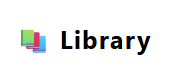

# Library Management System (Django + MySQL)

A modern, minimal, and RESTful Library Management System using Django, Django REST Framework and MYSQL (Workbench) database. It supports admin CRUD operations on books and allows students to view the book list.

Features
Admin Signup/Login with Token Authentication

Book CRUD (Create, Read, Update, Delete) by authenticated admins

Public view of books for students

Secure, RESTful API endpoints

Clean, minimal UI using Bootstrap

Django + MySQL integration

API testing using Postman

---

## Project Structure

LIBRARY_MANAGEMENT_SYSTEM/
├── library/
│   ├── __pycache__/
│   ├── migrations/
│   ├── templates/
│   │   ├── base.html
│   │   ├── book_list.html
│   │   ├── dashboard.html
│   │   ├── home.html
│   │   ├── login.html
│   │   └── signup.html
│   ├── __init__.py
│   ├── admin.py
│   ├── apps.py
│   ├── forms.py
│   ├── models.py
│   ├── serializers.py
│   ├── tests.py
│   ├── urls.py
│   └── views.py
├── library_project/
│   ├── __pycache__/
│   ├── __init__.py
│   ├── asgi.py
│   ├── settings.py
│   ├── urls.py
│   └── wsgi.py
├── venv/
├── manage.py
└── README.md

---

## Getting Started

### Prerequisites

- Python  3.12.10
- Django  5.2.3
- MySQL   8.0.30
- Postman (for testing APIs)  11.51.6

### Setup Instructions

1. **Clone the repository**:

   ```cmd
   git clone https://github.com/sandalikhobragade/library_management_system.git
   cd library_management_system

   Open the folder in VS Code.

2. **Create & activate virtual environment in VS Code Terminal:**:

    python -m venv venv
    source venv/bin/activate      # macOS/Linux
    venv\Scripts\activate         # Windows

3. **Install dependencies in terminal:**:

    pip install django djangorestframework mysqlclient

4. **settings.py Configuration:**:

 a. Add Required Apps:
    INSTALLED_APPS = [
    ...
    'rest_framework',
    'rest_framework.authtoken',
    'library',
]

 b. Set REST Framework Defaults(below Installed Apps):
    REST_FRAMEWORK = {
    'DEFAULT_AUTHENTICATION_CLASSES': [
        'rest_framework.authentication.TokenAuthentication',
    ]
}

 c. Custom User Model(place it in the bottom of the file):
    AUTH_USER_MODEL = 'library.AdminUser'

4. **Connecting to MySQL:**:

 a. Install MySQL client in terminal:
    pip install mysqlclient

 b. Update settings.py:
    DATABASES = {
    'default': {
        'ENGINE': 'django.db.backends.mysql',
        'NAME': 'library_db',
        'USER': 'your_mysql_user',
        'PASSWORD': 'your_mysql_password',
        'HOST': 'localhost',
        'PORT': '3306',
    }
}

 c. Create Database using MySQL Workbench:
    1. Open MySQL Workbench

    2.Connect to your MySQL server

    3.Open a new SQL tab and run:
      CREATE DATABASE library_db;
      USE library_db;
      INSERT INTO library_book (title, author, description, published_date)
      VALUES ('Django Basics', 'Tyler Williams', 'An intro to Django.', '2022-05-01'); // example data
      SELECT * FROM library_book;

    4.Run Django migrations in terminal:
      python manage.py makemigrations
      python manage.py migrate

    5.Run Project in terminal:
      python manage.py runserver

5. **Use Postman to Test REST API:**

   **Prerequisite**
   
   Before using Postman, Start your Django server:

   python manage.py runserver

   Ensure you have:

   . Django REST API routes correctly set up
   . Server running at http://127.0.0.1:8000/
   . The following endpoints:
     POST   /api/admin/signup/
     POST   /api/admin/login/
     POST   /api/books/create/
     GET    /api/books/
     PUT    /api/books/update/<id>/
     DELETE /api/books/delete/<id>/

6. **Step-by-Step Postman Instructions for Admin CRUD Operations:**

1. Open Postman:

   Launch Postman

   Click on Collections (left side menu).

   Click "New Collection".

   Name it: Library Management API

   Click "Create".

   Add the following requests inside:

2. Admin Signup (Create Admin User):
   Method: POST
   URL: http://127.0.0.1:8000/api/admin/signup/
   Request Body:
   Click Body tab → Select raw
   Choose JSON from dropdown 
   Paste this:
    {
  "email": "admin@example.com",
  "password": "admin123"
}
       
    Click: Send

    You will get a token in response like:
       {
  "token": "1a2b3c4d5e6f7g..."
}
 
Copy this token. You'll need it in headers later.

3. Admin Login (Get Token Again)

    Method: POST
    URL: http://127.0.0.1:8000/api/admin/login/
    Body → raw → JSON:
    {
  "email": "admin@example.com",
  "password": "admin123"
}

    Click: Send
    You’ll get:
    {
  "token": "your_token_here"
}

    Note: Copy this token — required for authorization headers in all further API calls.

Using Token in Headers:
For Create, Read, Update, Delete — add headers:
Go to the Headers tab
Add a new key-value pair:

| Key           | Value                   |
| ------------- | ----------------------- |
| Authorization | Token your\_token\_here |

Example:
Authorization  Token 1a2b3c4d5e6f7g...

4. Create a Book (POST)
    Method: POST
    URL: http://127.0.0.1:8000/api/books/create/

    Headers:
    Authorization: Token your_token_here

    Body → raw → JSON:
    {
  "title": "Django REST",
  "author": "Sandali",
  "published_date": "2024-06-15",
  "description": "Learning DRF"
}

    Click: Send
    Book will be created.

5. Read All Books (GET)
    Method: GET
    URL: http://127.0.0.1:8000/api/books/

    Headers:
    Authorization: Token your_token_here

    Click: Send
    You'll get a list of all books:
    [
  {
    "id": 1,
    "title": "Django REST",
    "author": "Sandali",
    "published_date": "2024-06-15",
    "description": "Learning DRF"
  }
]

6. Update a Book (PUT)
    Method: PUT
    URL: http://127.0.0.1:8000/api/books/update/1/
    Replace 1 with the actual book ID

    Headers:
    Authorization: Token your_token_here

    Body → raw → JSON:
    {
  "title": "Updated Book",
  "author": "Updated Author",
  "published_date": "2025-01-01",
  "description": "Updated description"
}

    Click: Send
    Book will be updated.

7. Delete a Book (DELETE)
    Method: DELETE
    URL: http://127.0.0.1:8000/api/books/delete/1/
    Replace 1 with the book ID to delete

    Headers:
    Authorization: Token your_token_here
    Click: Send
    Book will be deleted (response is usually empty 204 No Content).

8. Student Public View (GET)
    Method: GET
    URL: http://127.0.0.1:8000/api/student/books/
    No headers needed.
    Anyone (without login) can view all books.

Optional: Save Requests in Collection:
Click the 3 dots next to your request → Save Request
Save under Library Management API collection.
Organize requests: Signup, Login, Create, Read, Update, Delete

Exporting the Collection:
Click on the Library Management API collection (left pane).
Click 3 dots → Export.
Choose Collection v2.1, click Export.
Save the .json file — now you can share or import it later.

6. **Using the UI:**
    1. Home Page (/)
    Public landing page
     - click the word library present on top left corner everytime you want to see home page.

    2. Student View (/books/)
    Displays all books (read-only)
    Beautiful card/grid-based layout

    3. Admin Signup/Login (/signup/, /login/)
    Custom Django Forms
    Email + Password authentication
    Redirects to dashboard on login

    4. Admin Dashboard (/dashboard/)
    View all books
    Create a new book
    Edit/Delete existing books
    Protected: Only visible after login

Run Project Locally:
git clone <your_repo_url>
cd library_management_system
python -m venv venv
venv\Scripts\activate      # or source venv/bin/activate on macOS/Linux
pip install -r requirements.txt
python manage.py runserver


    

       
    
    
    

  
   


